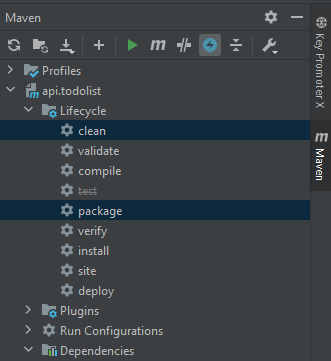
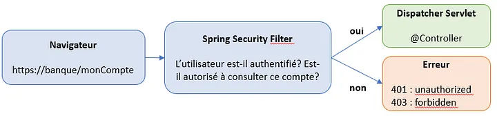
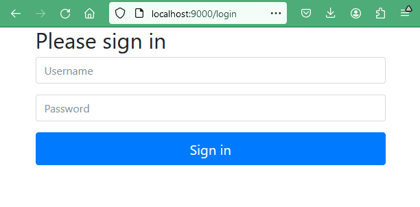
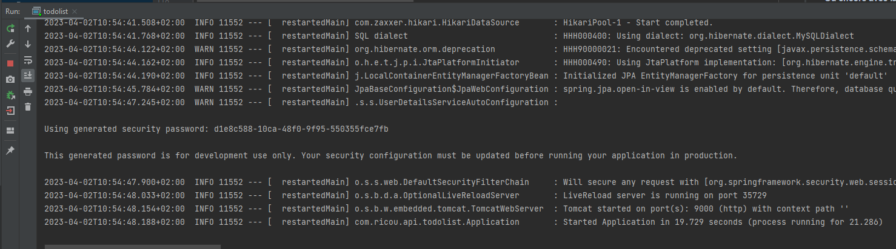
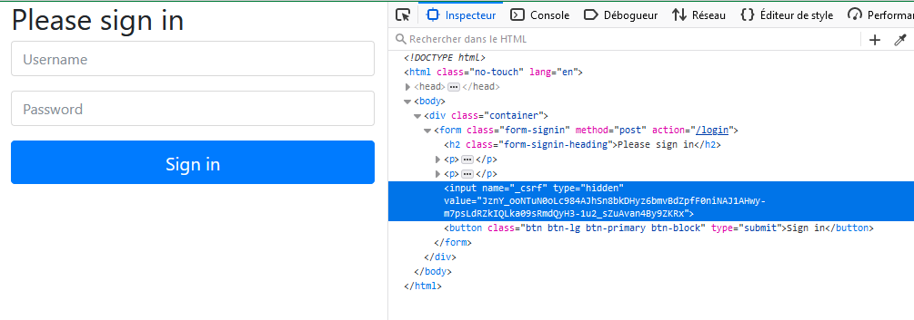
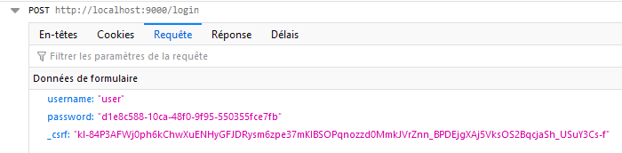
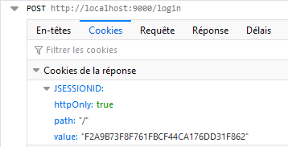
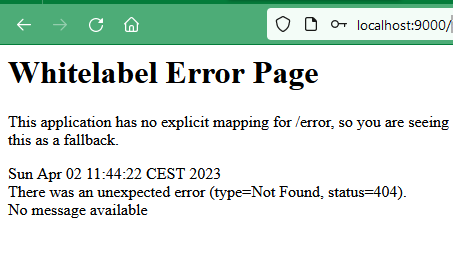
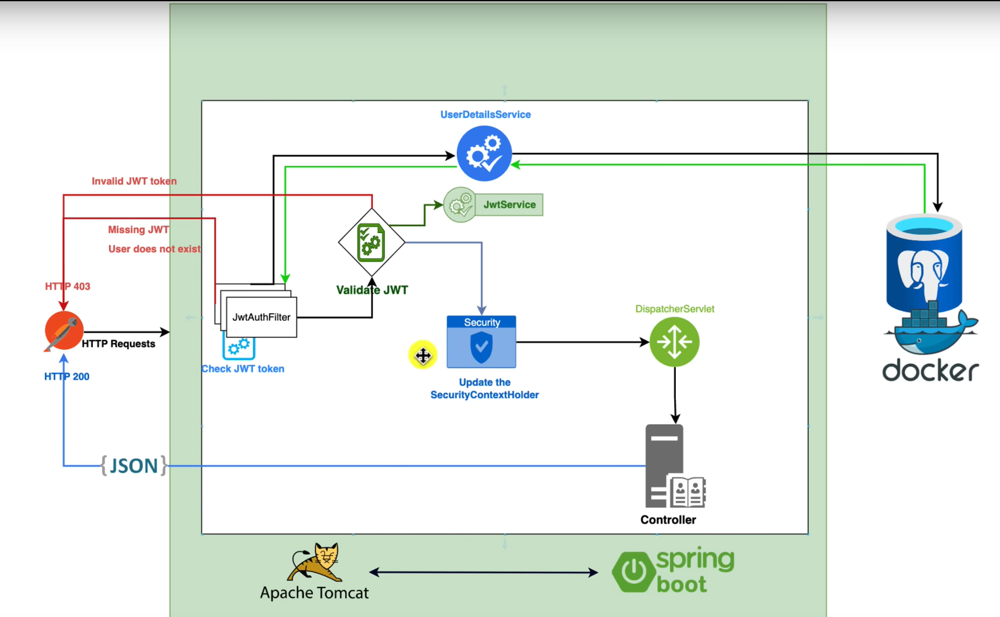

# AUTHENTIFICATION JWT AVEC SPRING BOOT

**Une application web (API RestFull) sécurisée (https) avec gestion de l'authentification des utilisateurs et stockage des données dans une BDD.**

# Initialiser le projet 

Avec le générateur https://start.spring.io/

- Project: maven
- Language: Java
- Spring Boot: dernière version non snapshot
- Project Metadata
   - Group: com
   - Artifact: api.jwt
   - Name: api.jwt
   - Description: Api avec authentification JWT pour Spring Boot
   - Package name:
   - Packaging: Jar ou War un fichier WAR (pour Web application Archive) est un fichier JAR utilisé pour contenir un ensemble de JavaServer Pages, servlets, classes Java, fichiers XML, et des pages web statiques (HTML, JavaScript…), le tout constituant une application web.
   - Java (version) : 17

**Les Paramètres sont stockées dans le *fichier pom.xml* à la racine du projet.**


## Les dépendances du projet

- **Spring Web Web** : Build web, including RESTful, applications using Spring MVC. Uses Apache Tomcat as the default embedded container.
- **Lombok Developer Tools** : C'est une bibliothèque Java qui aide à réduire le code et éviter les répétitions comme les getters, setters, etc.
- **Spring Data JPA SQL** : Utiliser Spring Data et Hibernate pour persister les données dans les magasins SQL avec l'API Java Persistence.
- **Spring Boot DevTools Developer Tool**s : Fournit des redémarrages rapides des applications, LiveReload et des configurations pour une expérience de développement améliorée.
- **OAuth2 Client Security** : Intégration de Spring Boot pour les fonctionnalités du client Spring Security OAuth2/OpenID Connect. (cas d'un "login with Google" par exemple)
- **Spring Security Security** : Cadre d'authentification et de contrôle d'accès hautement personnalisable pour les applications Spring.
- **MySQL Driver SQL** : Pilote JDBC pour MySQL.


## STRUCTURE DU PROJET MVC


## Configuration de l'application

 Le fichier `application.yml` offre une approche plus lisible et structurée pour la configuration par rapport au fichier `application.properties` utilisant la syntaxe clé=valeur.

Dans une application Spring Boot, le fichier `application.yml` est utilisé pour configurer des paramètres de l'application.

````
# ===============================================
# = CONFIGURATION DU SERVER WEB EMBARQUE TOMCAT =
# ===============================================
# Spring Boot incluent par défaut un serveur Web intégré préconfiguré, adresse et port du serveur  8080 par défaut.
server:
  port: 9000

# ======================================
# = CONFIGURATION DE LA JOURNALISATION =
# ======================================
logging:
  level:
    # Permet de voir dans la console le port utilisé par Tomcat au démarrage
    org.springframework.boot.web.embedded.tomcat: INFO
    root: INFO
    com.example: DEBUG

# =============================
# = DEFINIR PLUSIEURS PROFILS =
# =============================
# https://www.baeldung.com/spring-profiles

# deux profils : "dev" et "prod". Le profil actif est défini sur "dev"
spring:
  profiles:
    # profil a charger par défaut defini dans application.yml
    # active: dev
    # Profil Maven : peut être activé via la propriété de configuration spring.profiles.active
    #	  Sa valeur sera utilisée pour remplacer l' espace réservé @spring.profiles.active@ dans application.properties ou application.yml
    active: @spring.profiles.active@


---
spring:
  #  Définir des propriétés spécifiques pour chaque profil
  config:
    activate:
      on-profile: dev
  # ============================================
  # = CONFIGURATION DE LA BASE DE DONNEE MySQL =
  # ============================================
  datasource:
    url: jdbc:mysql://localhost:3306/auth_jwt
    username: root
    password:
    driver-class-name: com.mysql.cj.jdbc.Driver
  jpa:
    hibernate:
      # Generer ou mettre à jour automatiquement les tables de la base de données à partir des classes d'entites.
      # create-drop:
      # create: Crée le schema de BDD et detruit le prédécent
      # none: Désactive DDL
      # update: créer ou mets à jour le schéma de BDD si necessaire
      # validate:
      ddl-auto: create-drop
    # Le moyen le plus simple de vider les requêtes sql vers la sortie standard mais a priori non recommandé
    show-sql: true
    properties:
      hibernate:
        # Pour embellir
        format_sql: true
        #database: mysql
        #database-plateform:
      javax:
        persistence:
          schema-generation:
            scripts:
              # Génère un schéma de BDD avec Spring Boot JPA à partir des des entités
              # Actions ( https://www.baeldung.com/spring-data-jpa-generate-db-schema)
              #       none            - ne génère aucune commande DDL
              #       create          - génère uniquement des commandes de création de base de données
              #       drop            - génère uniquement des commandes de suppression de base de données
              #       drop-and-create - génère des commandes de suppression de base de données suivies de commandes de création
              # action: create
              # create-target: create.sql
              # create-source: metadata

---
spring:
  config:
    activate:
      on-profile: prod
  datasource:
    url: jdbc:mysql://localhost:3306/proddatabase
    username: produser
    password: prodpassword

````


## Compilation du projet avec Maven


**Autre possibilité**



**Ou encore avec la touche maven "_m_"**

Execute Maven Goal

`mvn clean package`

## Démarrer le projet


## Démarrer l'application avec Spring Boot Security

Spring Boot Security repose sur 2 principes :
- L’authentification : celui qui utilise l’application doit être identifié par un couple username/password.
- L'autorisations : tous les utilisateurs n’ont pas nécessairement accès aux mêmes fonctionnalités.

Spring Boot nous fournit donc un mot de passe par défaut en ajoutant Spring Security au classpath de notre application, 
Spring instaure une configuration par défaut, 
désormais pour accéder à notre application nous aurons besoin d’un User et d’un mot de passe.

Cette interaction est orchestrée par la Dispatcher Servlet de Spring, 
qui permet d’adresser les requêtes aux différents controllers de l’application. 

En résumé, Spring Security ne fait qu’ajouter des traitements à cette orchestration, par le biais de Servlet Filters. 

**L’ensemble des Servlet Filters constitue la Filter Chain de Spring Security**.



Cliquer sur la flèche verte en haut a droite `"Run api.todolist"` pour démarrer l'apllication.

Accèder à la page web à l'adresse suivante : [http://localhost:9000](http://localhost:9000)

Le routeur interne nous redirige automatiquement vers la page login via la soumission de formulaire d’authentification car nous ne somme pas authentifié.

DefaultLoginPageGeneratingFilter : construit une page d’authentification par défaut, à moins d’être explicitement désactivé. C’est pour cette raison qu’une page de login apparaît lors de l’activation de Spring Security, avant même que le développeur ne code une page personnalisée.

UsernamePasswordAuthenticationFilter : analyse une soumission de formulaire d’authentification, qui doit fournir un couple username/password. Ce filtre est activé par défaut sur l’URL /login.



Username : `user`

Password : Celui afficher dans la console (run) : Using generated security password: d1e8c588-10ca-48f0-9f95-550355fce7fb




Par defaut spring boot security forunit une protection csrf sur les formulaires

CsrfFilter : applique une protection contre les attaques de type Cross-Site Request Forgery en utilisant un token, usuellement stocké dans la HttpSession. Il est souvent demandé aux développeurs d’invoquer ce filtre avant toute requête susceptible de modifier l’état de l’application (usuellement les requête de type POST, PUT, DELETE et parfois OPTIONS).



Requête envoyée au serveur aprés soumission du formulaire d'authentification
- username
- password
- jeton crsf



Le serveur vérifie si l'utlisateur est authentifié puis envoie un cookie de session contenant l'identifiant.

Chaque fois que l'utilisateur enverra une requête au serveur, le cookie de session sera automatiquement transmis au serveur qui pourra authentifier l'utilisateur.

**UsernamePasswordAuthenticationFilter** : analyse une soumission de formulaire d’authentification, qui doit fournir un couple username/password. Ce filtre est activé par défaut sur l’URL /login.



Ce message d'erreur signifie qu'il n'exite pas de page web a renvoyer.



pour en créer une dans le dossier `src\main\ressources\static\index.html`

````html
<!DOCTYPE html>
<html lang="fr">
<head>
    <meta charset="UTF-8">
    <title>HomePage</title>
</head>
<body>
<h1>Hello world !!!!</h1>
</body>
</html>
````


## LE MODEL (persistance des données en BDD)

### Configuration de l'accès à la BDD


### Connecteur JDBC

L’interface Java Database Connectivity ou JDBC est une API intégrée à la Java Standard Edition pour communiquer avec des bases relationnelles. Elle est censée normaliser cette communication: en principe une application s’appuyant sur JDBC peut de manière transparente passer d’une base MySQL à PostgreSQL ou à un autre système relationnel.


###  Création de la class  User  dans le dossier `Model` (objet représentant la table dans la base de données).

Une entité JPA est, par définition, une classe Java qui doit avoir les propriétés suivantes :
- Elle doit posséder un constructeur vide, public ou protected. Rappelons que ce constructeur vide existe par défaut si aucun constructeur n'existe dans la classe. Dans le cas contraire, il doit être ajouté explicitement.
- Elle ne doit pas être final, et aucune de ses méthodes ne peut être final.
- Une entité JPA ne peut pas être une interface ou une énumération.
- Une entité JPA peut être une classe concrête ou abstraite.

#### La classe `User` pour l'authentification et les autorisations

````java
// src/main/java/com/api/jwt/Model/UserEntity.java

package com.api.jwt.Model;

import com.api.jwt.security.Role;
import jakarta.persistence.*;
import lombok.AllArgsConstructor;
import lombok.Builder;
import lombok.Data;
import lombok.NoArgsConstructor;
import org.springframework.security.core.authority.SimpleGrantedAuthority;
import org.springframework.security.core.userdetails.UserDetails;
import org.springframework.security.core.GrantedAuthority;

import java.io.Serializable;
import java.time.LocalDateTime;
import java.util.*;

/* 
L'annotation @Data est un raccourci pratique fourni par la bibliothèque Lombok pour générer
suivantes :
    - Getters : Lombok crée des getters pour tous les champs non statiques de la classe.
    - Setters : Lombok génère des setters pour tous les champs non finaux et non statiques de la classe.
    - equals() et hashCode() : Lombok génère des implémentations de ces méthodes basées sur les champs de la classe.
    - toString() : Lombok crée une méthode toString() qui inclut le nom de la classe, ainsi que les noms et valeurs de tous les champs.
*/
@Data

/*
L'annotation @Builder est un raccourci pratique fourni par la bibliothèque Lombok utilisée pour générer automatiquement un constructeur de type "Builder" dans une classe.
Lombok génère un constructeur spécial appelé "Builder" qui vous permet de créer des instances de la classe de manière plus fluide et expressive.
*/
@Builder

/*
L'annotation @NoArgsConstructor est un raccourci pratique fourni par la bibliothèque Lombok utilisée pour générer automatiquement un constructeur sans arguments dans une classe.
Cela permet de créer des instances de la classe sans avoir à spécifier explicitement les arguments du constructeur.
*/
@NoArgsConstructor

/*
L'annotation @AllArgsConstructor est un raccourci pratique fourni par la bibliothèque Lombok utilisée pour générer automatiquement un constructeur prenant en compte tous les champs de la classe en tant que paramètres.
*/
@AllArgsConstructor

/*
L'annotation @Entity est utilisée dans le framework Java Persistence API (JPA) pour indiquer qu'une classe est une entité persistante, c'est-à-dire qu'elle représente une table dans une base de données relationnelle. 
cela indique que cette classe doit être mappée à une table dans la base de données.
*/
@Entity

/*
L'annotation @Table est utilisée dans le framework Java Persistence API (JPA) en conjonction avec l'annotation @Entity pour spécifier des informations supplémentaires sur la table correspondante à une entité persistante comme le nom de la table, le schéma de la table et d'autres attributs liés à la table dans la base de données.
*/
@Table(name = "user")
public class UserEntity implements Serializable, UserDetails {
    /* ID
    L’identifiant est indiqué avec l’annotation @Id
     */
    @Id
    @GeneratedValue(strategy = GenerationType.IDENTITY)
    private Long id;

    /*
	L'annotation @Column est utilisée en conjonction avec l'annotation @Entity pour personnaliser les propriétés de la colonne associée à ce champ dans la table de la base de données, telles que le nom de la colonne, le type de données, la longueur, etc.
	*/
    @Column(name = "created_at")
    private LocalDateTime createdAt;

    /*
	L'annotation @PrePersist est utilisée pour marquer une méthode qui doit être exécutée avant la persistance d'une entité dans la base de données.
	*/
    @PrePersist
    public void prePersist() {
        createdAt = LocalDateTime.now();
    }

    @Column(name = "updated_at")
    private LocalDateTime updatedAt;

    @Column(name="email", length = 255, unique = true)
    private String email;

    @Column(name="password", length = 255)
    private String password;

    @Column(name = "lastname", length = 255)
    private String lastname;

    @Column(name="firstname", length = 255)
    private String firstname;

    /*
	 Annotation utilisée dans le framework Java 
*/
    @Enumerated(EnumType.STRING)
    private Role role;

    /*

*/
    @Override
    public Collection<? extends GrantedAuthority> getAuthorities() {
        return List.of(new SimpleGrantedAuthority(role.name()));
    }

    @Override
    public String getPassword(){
        return password;
    }

    @Override
    public String getUsername(){
        return email;
    }

    @Override
    public boolean isAccountNonExpired() {
        return true;
    }

    @Override
    public boolean isAccountNonLocked() {
        return true;
    }

    @Override
    public boolean isCredentialsNonExpired() {
        return true;
    }

    @Override
    public boolean isEnabled() {
        return true;
    }

    @Override
    public String toString() {
        return this.id + " : " + this.lastname + " " + this.firstname + " " + this.email;
    }

}
````


Liste d'annotation  fournies par la bibliothèque Lombok, ainsi que leurs rôles respectifs

````
Voici une liste plus complète des annotations fournies par la bibliothèque Lombok, ainsi que leurs rôles respectifs :

1. `@Data`: Génère automatiquement les méthodes `toString()`, `equals()`, `hashCode()`, les getters et les setters pour tous les champs de la classe.

2. `@Getter` / `@Setter`: Génère automatiquement les getters et/ou les setters pour les champs spécifiés.

3. `@NoArgsConstructor`: Génère un constructeur sans arguments.

4. `@AllArgsConstructor`: Génère un constructeur prenant en compte tous les champs de la classe.

5. `@RequiredArgsConstructor`: Génère un constructeur prenant en compte uniquement les champs marqués avec `final` ou `@NonNull`.

6. `@Builder`: Génère un constructeur de type "Builder" pour une initialisation fluide et lisible des instances de classe.

7. `@ToString`: Génère automatiquement la méthode `toString()` pour la classe.

8. `@EqualsAndHashCode`: Génère automatiquement les méthodes `equals()` et `hashCode()` en utilisant les champs spécifiés.

9. `@Slf4j`: Génère un logger Slf4j pour la classe.

10. `@Cleanup`: Gère automatiquement la fermeture des ressources telles que les flux (stream) dans un bloc `try-finally`.

11. `@SneakyThrows`: Permet de lancer des exceptions vérifiées sans les déclarer dans la signature de la méthode.

12. `@Value`: Génère une classe immuable avec des getters, `equals()`, `hashCode()` et une implémentation `toString()`.

13. `@NonNull`: Génère automatiquement une vérification de non-nullité pour un champ ou un paramètre de méthode.

14. `@Setter(AccessLevel.NONE)`: Génère un setter privé pour un champ spécifié.

15. `@Getter(AccessLevel.PROTECTED)`: Génère un getter protégé pour un champ spécifié.

16. `@NoArgsConstructor(access = AccessLevel.PRIVATE)`: Génère un constructeur sans arguments privé.

17. `@AllArgsConstructor(access = AccessLevel.PROTECTED)`: Génère un constructeur prenant en compte tous les champs de la classe avec un niveau d'accès protégé.

18. `@Builder.Default`: Permet de spécifier une valeur par défaut pour un champ dans un constructeur de type "Builder".

19. `@EqualsAndHashCode.Exclude`: Exclut un champ spécifié de la génération des méthodes `equals()` et `hashCode()`.

20. `@ToString.Exclude`: Exclut un champ spécifié de la génération de la méthode `toString()`.

Cette liste couvre les annotations les plus couramment utilisées de Lombok. Chaque annotation offre une fonctionnalité spécifique visant à simplifier le développement en réduisant le code boilerplate dans les classes Java.
````


Liste d'annotations couramment utilisées dans le développement avec Spring Boot

````
1. `@SpringBootApplication`: Annotation utilisée pour marquer la classe principale de l'application Spring Boot. Elle combine les annotations `@Configuration`, `@EnableAutoConfiguration` et `@ComponentScan`.

2. `@RestController`: Annotation utilisée pour marquer une classe qui expose des API REST. Elle est utilisée en conjonction avec `@RequestMapping` pour définir les points de terminaison REST.

3. `@RequestMapping`: Annotation utilisée pour définir les points de terminaison d'une API REST. Elle peut être appliquée au niveau de la classe pour définir le préfixe commun des URL, ou au niveau des méthodes pour définir les URL spécifiques.

4. `@GetMapping`, `@PostMapping`, `@PutMapping`, `@DeleteMapping`: Annotations utilisées pour définir respectivement des méthodes GET, POST, PUT et DELETE pour les points de terminaison d'une API REST.

5. `@PathVariable`: Annotation utilisée pour lier une variable de chemin dans une URL à un paramètre d'une méthode de contrôleur.

6. `@RequestParam`: Annotation utilisée pour lier un paramètre de requête dans l'URL à un paramètre d'une méthode de contrôleur.

7. `@RequestBody`: Annotation utilisée pour lier le corps d'une requête HTTP à un objet Java dans une méthode de contrôleur.

8. `@Autowired`: Annotation utilisée pour injecter automatiquement une dépendance dans une classe. Elle peut être utilisée pour injecter des dépendances via les constructeurs, les méthodes setter ou les champs.

9. `@Service`: Annotation utilisée pour marquer une classe en tant que service. Les classes annotées avec `@Service` sont candidates pour l'injection de dépendances et sont détectées par l'analyse de composants de Spring.

10. `@Repository`: Annotation utilisée pour marquer une classe en tant que repository (ou DAO - Data Access Object). Les classes annotées avec `@Repository` sont détectées par Spring pour la gestion des opérations de persistance des données.

11. `@Component`: Annotation générique utilisée pour marquer une classe en tant que composant. Elle peut être utilisée pour diverses classes dans l'application.

12. `@Configuration`: Annotation utilisée pour marquer une classe de configuration de Spring. Elle est utilisée pour définir des beans et des configurations spécifiques de l'application.

13. `@Value`: Annotation utilisée pour injecter des valeurs de propriétés depuis un fichier de configuration (application.properties ou application.yml) dans les classes Spring.

14. `@Transactional`: Annotation utilisée pour définir la portée transactionnelle d'une méthode ou d'une classe. Elle permet de gérer les transactions de manière automatique.

Ces annotations sont largement utilisées dans le développement avec Spring Boot pour configurer l'application, définir des points de terminaison REST, gérer les dépendances et la persistance des données, et bien plus encore.
````


### Générer un schema de la BDD avec Spring Boot JPA à partir d'un script sql

[Tuto baeldung](https://www.baeldung.com/spring-data-jpa-generate-db-schema)

````properties
# ressources\application.properties

spring.jpa.properties.javax.persistence.schema-generation.scripts.action=
Les actions

- **none**            : ne génère aucune commande DDL
- **create**          : génère uniquement des commandes de création de base de données
- **drop**            : génère uniquement des commandes de suppression de base de données
- **drop-and-create** : génère des commandes de suppression de base de données suivies de commandes de création
````

Exemple  :

````properties
# ressources\application.properties

spring.jpa.properties.javax.persistence.schema-generation.scripts.action=create
spring.jpa.properties.javax.persistence.schema-generation.scripts.create-target=create.sql
spring.jpa.properties.javax.persistence.schema-generation.scripts.create-source=metadata
````


### Générer les tables de la BDD avec Spring Boot JPA

Spring Boot genere ou mets à jour automatiquement les tables de la base de données à partir des entites.

````properties
# ressources\application.properties

spring.jpa.hibernate.ddl-auto=update
````


## Spring Boot Security et auth2 - Authentification et autorisation avec JWT (Json Web Token)



– **WebSecurityConfig** est au cœur de notre mise en œuvre de la sécurité. Il configure cors, csrf, la gestion de session, 
les règles pour les ressources protégées. Nous pouvons également étendre et personnaliser la configuration par défaut qui contient
les éléments ci-dessous.
( **WebSecurityConfigurerAdapter** est obsolète à partir de Spring 2.7.0, vous pouvez vérifier le code source pour la mise à jour. Plus de détails sur :
WebSecurityConfigurerAdapter obsolète dans Spring Boot).

– **UserDetailsService** l'interface a une méthode pour charger l'utilisateur par nom d'utilisateur et renvoie 
un UserDetailsobjet que Spring Security peut utiliser pour l'authentification et la validation.

– **UserDetails** contient les informations nécessaires (telles que : nom d'utilisateur, mot de passe, autorités) 
pour créer un objet d'authentification.

– **UsernamePasswordAuthenticationToken** obtient {nom d'utilisateur, mot de passe} à partir de la demande de connexion, 
**AuthenticationManager** l'utilisera pour authentifier un compte de connexion.

– **AuthenticationManager** a un DaoAuthenticationProvider(avec l'aide de UserDetailsService& PasswordEncoder) valider 
**UsernamePasswordAuthenticationToken** objet. En cas de succès, **AuthenticationManager** renvoie un objet Authentication
entièrement renseigné (y compris les droits accordés).

– **OncePerRequestFilter** effectue une seule exécution pour chaque requête adressée à notre API. 
Il fournit une **doFilterInternal()** méthode que nous allons implémenter en parsant et en validant JWT, 
en chargeant les détails de l'utilisateur (en utilisant UserDetailsService), cochant Autorisation 
(en utilisant UsernamePasswordAuthenticationToken).

– **AuthenticationEntryPoint** détectera l'erreur d'authentification.

Le référentiel contient UserRepository & RoleRepositorypour travailler avec Database, sera importé dans Controller .

Le contrôleur reçoit et traite la demande après qu'elle a été filtrée par OncePerRequestFilter.

– **AuthController** gère les demandes d'inscription/de connexion

– **TestController** a accès à des méthodes de ressources protégées avec des validations basées sur les rôles.

Comprenez l'architecture en profondeur et saisissez la vue d'ensemble plus facilement :
Architecture Spring Boot pour JWT avec Spring Security

### 6.1- JWT Authentication and Authorisation

https://www.youtube.com/watch?v=KxqlJblhzfI

Toute application Web Spring n'est qu'un seul servlet : le DispatcherServlet de Spring, 
qui redirige les requêtes HTTP entrantes (par exemple depuis un navigateur) vers vos @Controllers ou @RestControllers.

Il n'y a pas de sécurité codée en dur dans ce DispatcherServlet, l'authentification et l'autorisation doivent 
être effectuées avant qu'une demande n'atteigne vos @Controllers.

Il existe un moyen de faire exactement cela dans le monde du Web Java en plaçant les filtres devant les servlets.
Ce qui signifie que vous pouvez penser à écrire un SecurityFilter et le configurer dans votre Tomcat 
(conteneur de servlet/serveur d'application) pour filtrer chaque entrée Requête HTTP avant qu'elle n'atteigne 
votre servlet.

### 6.1- Cryptage des mot de passe dans la BDD
2 beans doivent être déclarés pour que l’authentification soit opérationnelle : 
une implémentation de l’interface UserDetailsService, et un PasswordEncoder.
- **UserDetailsService** : l’implémentation de cette interface doit comporter une méthode renvoyant un objet de type UserDetails à partir d’un simple identifiant d’utilisateur. Cet objet contient à minima le couple username/password, ainsi que généralement la liste des rôles (c’est à dire les autorisations) de l’utilisateur. Il est tout à fait possible d’utiliser/d’étendre les implémentations toutes faites fournies par Spring Security.
- **PasswordEncoder** : permet de spécifier quel algorithme d’encryption utiliser sur les mots de passe. L’algorithme par défaut de Spring Security est BCrypt. Il est tout à fait possible d’utiliser différents algorithmes selon les utilisateurs, option sur laquelle nous ne nous attarderons pas.

Mise en place l’authentification

BasicAuthenticationFilter : Vérifie la présence dans la requête reçue d’un header de type basic auth, et le cas échéant, 
essaie d’authentifier l’utilisateur avec le couple username/password récupéré dans ce header.


Annotations
**@Override**: définir une méthode qui est héritée de la classe parente. On ne l'utilise donc que dans le cas de l'héritage.

**@Beans**: définir une méthode qui représente est un objet qui est instancié, assemblé et géré par Spring IoC Container un processus qui définit 
les dépendances d’un objet sans avoir à les créer. C’est lors de la création des objets, que Spring va injecter
les Beans entre eux afin d’avoir toutes leurs dépendances.
********************************************************************************************************************
********************************************************************************************************************
    /*
    Dans le jargon ORM, ce côté est « responsable » de la gestion du mapping.
    Dans la base relationnelle, c’est du côté plusieurs que l’on trouve la clé étrangère.
    Donc l’annotation @ManyToOne implique que la table Todo contient une colonne qui est une clé étrangère contenant la clé d’un user.
    Par défaut, JPA s’attend à ce que cette colonne se nomme USER_ID, mais il est possible de changer ce nom grâce à l’annotation @JoinColumn.
    Plutôt que par une colonne, il est également possible d’indiquer à JPA qu’il doit passer par une table d’association pour établir la relation entre les deux entités avec l’annotation @JoinTable
     */
    
    /*
    // Ajoute ou cible le champ user_id dans la table todo pour conserver la référence de la clé étrangère utilisateur
    @ManyToOne(cascade = CascadeType.ALL)
    @JoinColumn(name = "user_id")
    private UserEntity user;
    */
    
    /*
     Passer par la création d'une table d’association
     @ManyToOne(cascade = CascadeType.ALL)
     @JoinTable(name = "user_todos",
        joinColumns = @JoinColumn(name = "user_id"),
        inverseJoinColumns = @JoinColumn(name = "todos_id"))
     private UserEntity user;
*/

# Sauvegarde du fichier de config `application.properties`

Allez dans `ressources\application.properties`

````
# Spring Boot incluent par défaut un serveur Web intégré préconfiguré, adresse et port du serveur  8080 par défaut.
server.port=9000
# server.address=my_custom_ip
logging.level.org.springframework.boot.web.embedded.tomcat=INFO

# GENERER UN SCHEMA DE BASE DE DONNEES AVEC SPRING BOOT JPA
# Actions ( https://www.baeldung.com/spring-data-jpa-generate-db-schema)
#       none            - ne génère aucune commande DDL
#       create          - génère uniquement des commandes de création de base de données
#       drop            - génère uniquement des commandes de suppression de base de données
#       drop-and-create - génère des commandes de suppression de base de données suivies de commandes de création
spring.jpa.properties.javax.persistence.schema-generation.scripts.action=create
spring.jpa.properties.javax.persistence.schema-generation.scripts.create-target=create.sql
spring.jpa.properties.javax.persistence.schema-generation.scripts.create-source=metadata

# Spring Boot genere ou met à jour automatiquement les tables de la base de données.
spring.jpa.hibernate.ddl-auto=update
##########################################################################
#                               MySQL Configuration                      #
##########################################################################
spring.jpa.hibernate.ddl-auto=update
# spring.datasource.url=jdbc:mysql://${MYSQL_HOST:localhost}:3306/db_example
spring.datasource.url=jdbc:mysql://localhost:3306/todolist
spring.datasource.username=root
spring.datasource.password=
spring.datasource.driver-class-name=com.mysql.cj.jdbc.Driver
````


# Annotations Java

**@override** est utilisé pour définir une méthode qui est héritée de la classe parente. On ne l'utilise donc que dans le cas de l'héritage. 
En plaçant ce mot-clé dans le commentaire de la méthode réécrite, 
le compilateur vérifiera que la méthode est correctement utilisée (mêmes arguments, même type de valeur de retour) 
et affichera un message d'avertissement si ce n'est pas le cas.
Ecrire ce commentaire permet également au développeur d'avoir une meilleure lisibilité du code. Depuis la version 1.6 de Java, 
le mot-clé @override est également utilisé pour une méthode qui implémente une interface. 
Le compilateur affichera également un avertissement si le prototype de la méthode originale n'est pas respecté.

**@Secured** est utilisée pour spécifier une liste de rôles sur une méthode. Ainsi, un utilisateur ne peut accéder à cette méthode que s'il a au moins un des rôles spécifiés
````java
// seuls les utilisateurs qui ont le rôle ROLE_VIEWER peuvent exécuter la méthode getUsername 
@Secured("ROLE_VIEWER")
public String getUsername(){
    SecurityContext securityContext=SecurityContextHolder.getContext();
    return securityContext.getAuthentication().getName();
}
````
Définir une liste de rôles dans une annotation @Secured
````java
// Un utilisateur ne peut invoquer isValidUsername2 que s'il possède au moins l'un des rôles ROLE_VIEWER ou ROLER_EDITOR
@Secured({ "ROLE_VIEWER", "ROLE_EDITOR" })
public boolean isValidUsername(String username) {
    return userRoleRepository.isValidUsername(username);
}
````

@PreAuthorize et @PostAuthorize fournissent un contrôle d'accès basé sur l'expression
````java
// @PreAuthorize(“hasRole('ROLE_VIEWER')”) a la même signification que @Secured(“ROLE_VIEWER”)
@PreAuthorize("hasRole('ROLE_VIEWER')")
public boolean isValidUsername(String username) {
    //...
}
````
````java
// @Secured({“ROLE_VIEWER”,”ROLE_EDITOR”}) peut être remplacée par @PreAuthorize(“hasRole('ROLE_VIEWER') or hasRole('ROLE_EDITOR')”) 
@PreAuthorize("hasRole('ROLE_VIEWER') or hasRole('ROLE_EDITOR')")
public boolean isValidUsername(String username) {
    //...
}
````

````java
// un utilisateur peut invoquer la méthode getMyRoles uniquement si 
// la valeur de l'argument username est la même que le nom d'utilisateur actuel du principal.
@PreAuthorize("#username == authentication.principal.username")
public String getMyRoles(String username) {
        //...
        }
````
````java
// la méthode loadUserDetail ne s'exécutera avec succès que si 
// 
// le nom d'utilisateur du CustomUser renvoyé est égal au pseudonyme du principal d'authentification actuel 
@PostAuthorize
  ("returnObject.username == authentication.principal.nickName")
public CustomUser loadUserDetail(String username) {
    return userRoleRepository.loadUserByUserName(username);
}
````


